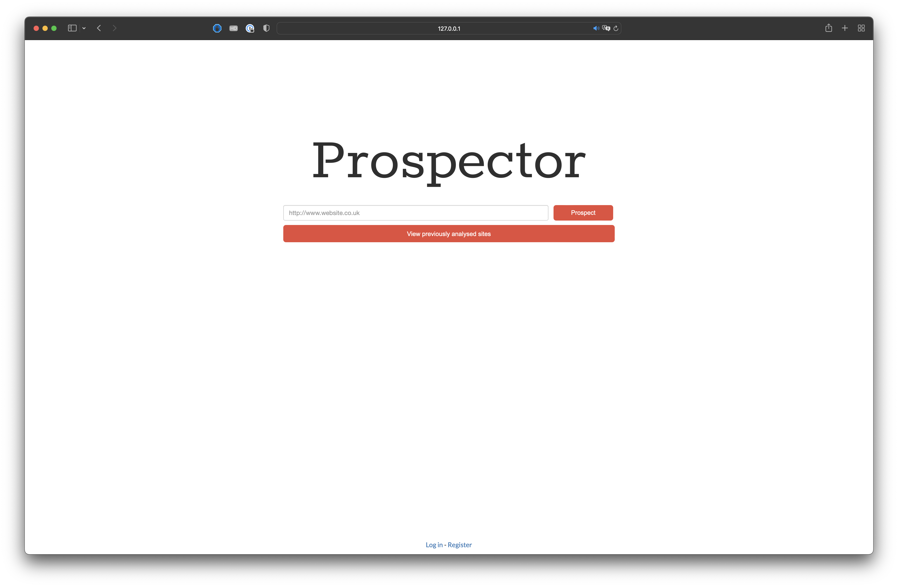
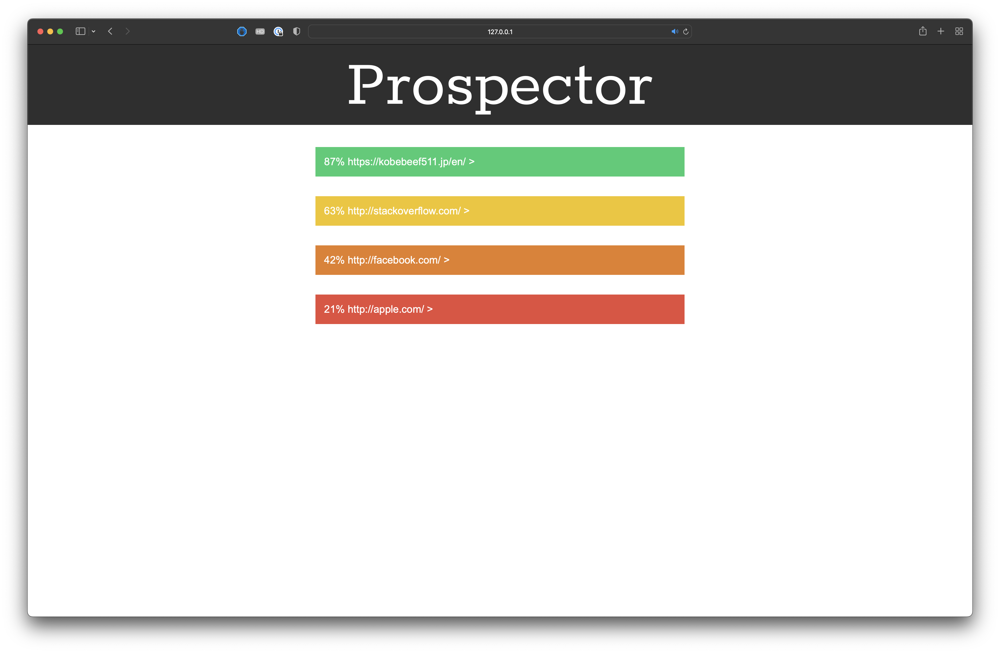
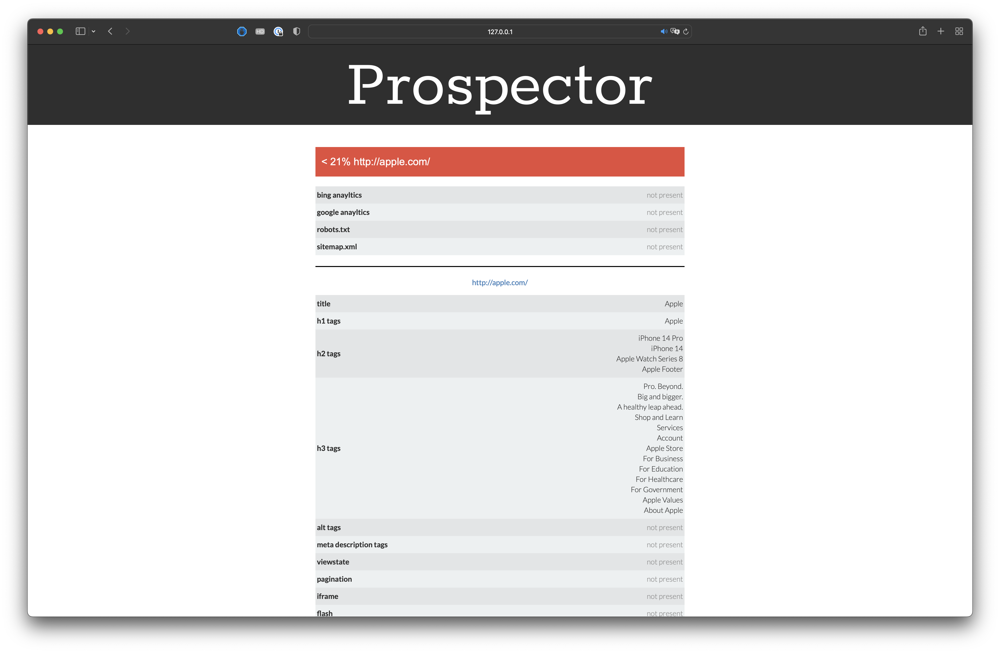
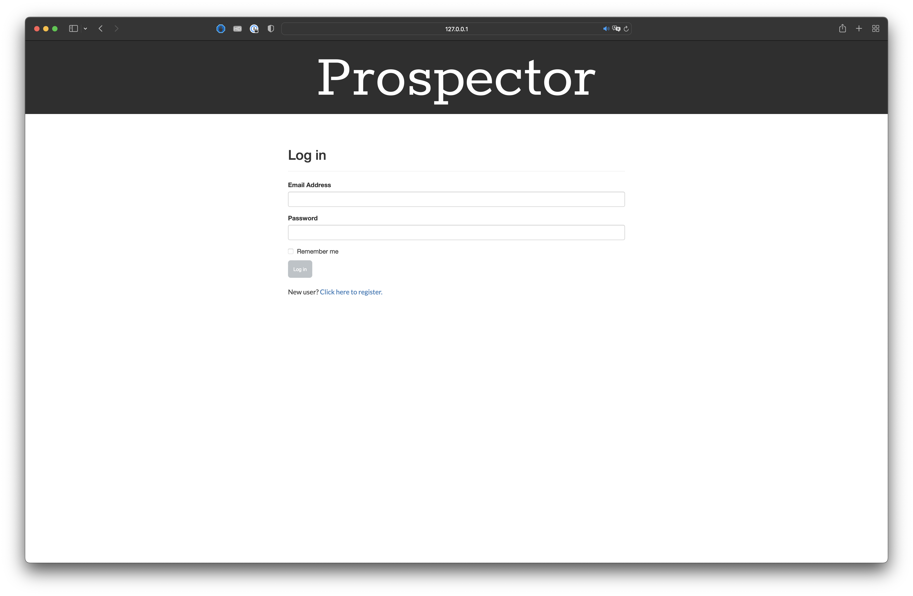

# Prospector

**A web application that scrapes a website and provides relevant detailed information regarding its Search Engine Optimisation.** This was originally built to automate the manual prospecting work an SEO team did to find local clients for potential SEO business.

## Design









## Set up and Installation

**Technologies as of 16/01/23:**

* Python 3.10.6
* psql (PostgreSQL) 14.5 (Homebrew)

### Database Set up

In Psql run:

```sql
CREATE USER prospector WITH ENCRYPTED PASSWORD 'password';
CREATEDB prospector;
```

### Unix installation

In the root directory run:

    virtualenv venv
    source venv/bin/activate
    pip install -r requirements.txt
    python manage.py db_create

## Helpful commands

Start the server:

```bash
python manage.py runserver
```

To run rests, ensure you are in the virtualenv and in the root directory run:

    nosetests
